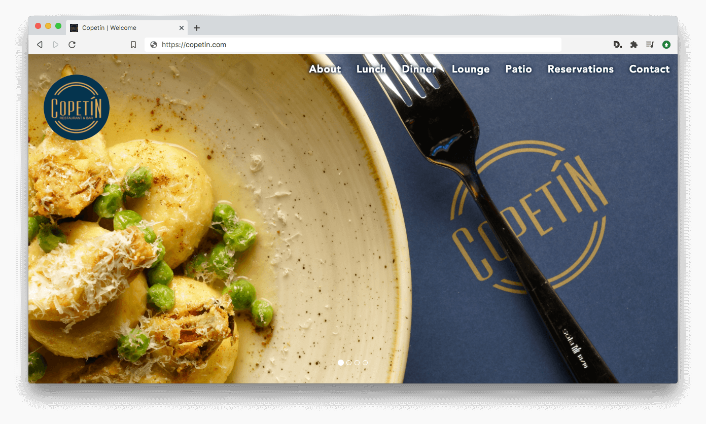

# Website Mockup for Toronto Restaurant Copetín

## Intro

This project was a website mockup-makeover for **Copetín**, the now defunct gourmet restaurant of Toronto celebrity Chef Claudio Aprile. For this project I redesigned Copetín's previous stark landing-page website to provide a much bolder, more modern layout, while expanding on the restaurant's existing branding, logo, and color themes. Goals were to take their existing content and elevate it into an elegant, stylish, one-page website that matched the restaurant's cachet and haute cuisine.

## Stack and tools

The site was built with HTML5, CSS3, Bootstrap 3, Flexbox, and Javascript. It features a responsive one-page layout with smooth anchor scrolling menu, hero image carousel, full restaurant menu presentation (previous iteration had lo-fi PDFs loading in new browser tabs), Open Table reservation API, social media integration, hours and contact information, custom font, with branding and colour themes extended creatively throughout. While the project didn't move forward (and the restaurant closed), it was a huge improvement on Copetin's existing site and was instructive in designing for the restaurant industry and exploring the Open Table API.
